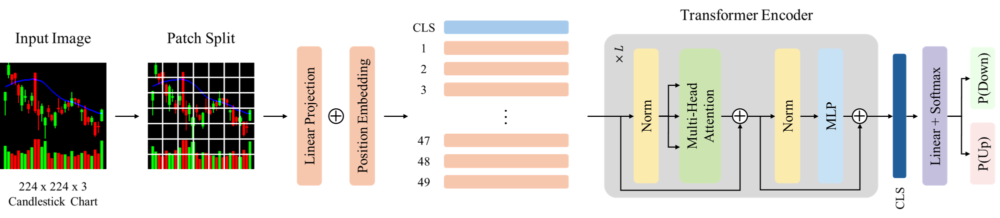

# chart-vit-xai

Official implementation of "Interpretable chart-based decision support for cross-sectional stock selection".

---

## Overview

This paper applies a Vision Transformer to candlestick chart images to predict the cross-sectional direction of U.S. stock returns.

<p align="center">
  
</p>

Pipeline:

1. Chart image generation — RGB candlestick charts (224×224) with OHLC, MA20, and volume bars across 20/25/30-day windows
2. Vision Transformer training — ViT-B/32 with reduced encoder depth, trained with RS2 random subset sampling
3. CNN baseline — Grayscale OHLC bar charts (64×60) reproducing Jiang et al. (2023)
4. Portfolio backtest — Monthly rebalancing, decile-sorted equally-weighted long-short portfolios (2001–2025)
5. Interpretability — Chefer et al. (2021) class-specific relevancy maps

---

## Table of Contents

- [Overview](#overview)
- [Project Structure](#project-structure)
- [Requirements](#requirements)
- [Installation](#installation)
- [Usage](#usage)
- [Data Availability](#data-availability)

---

## Project Structure

```
chart-vit-xai/
│
├── data_pipeline/                      # CRSP → chart images → train/valid splits
│   ├── preprocess_train.py             # CRSP Ver1 → per-stock pickles (1993–2000)
│   ├── preprocess_test.py              # CRSP Ver2 → per-stock pickles (2001–2025) + rebalance dates
│   ├── image_gen_train_rgb.py          # 224×224×3 RGB charts (train, 20/25/30d)
│   ├── image_gen_train_gray.py         # 64×60×1 grayscale bar charts (CNN baseline, train)
│   ├── image_gen_test_rgb.py           # 224×224×3 RGB charts (test, rebalance dates only)
│   ├── image_gen_test_gray.py          # 64×60×1 grayscale bar charts (CNN baseline, test)
│   └── create_splits.py                # Stratified train/valid splits per seed
│
├── modeling/                           # Model training and inference
│   ├── train_vit.py                    # Train ViT-B/32 or ViT-B/16
│   ├── train_cnn.py                    # Train CNN baseline (xiu_20)
│   ├── test_vit.py                     # ViT inference → monthly predictions
│   └── test_cnn.py                     # CNN inference → monthly predictions
│
├── backtest/                           # Portfolio construction & evaluation
│   ├── backtest_preprocess.py          # Build ret/vol/cap/prc matrices from CRSP Ver2
│   ├── portfolio_backtest.ipynb        # Decile-sorted ensemble portfolios
│   └── performance_metrics.ipynb       # Sharpe, Sortino, drawdown, plots
│
├── interpretability/                   # Explainability analysis
│   ├── xai_candidate_selection.ipynb   # Select samples for relevancy visualization
│   └── chefer.py                       # Generate Chefer relevancy maps
│
├── scripts/                            # SLURM submission scripts
│   ├── train_vit.sh
│   ├── train_cnn.sh
│   ├── test_vit.sh
│   └── test_cnn.sh
│
├── DB/                                 # Data directory (not tracked)
├── experiments/                        # Model checkpoints (not tracked)
│
├── requirements.txt
├── .gitignore
└── README.md
```

---

## Requirements

- Python 3.10
- CUDA 12.8 (tested; other CUDA versions should work with matching PyTorch)

Main dependencies:

- `torch==2.8.0+cu128`, `torchvision==0.23.0+cu128`
- `pandas`, `numpy`, `h5py`, `scikit-learn`, `scipy`
- `opencv-python`, `Pillow`
- `statsmodels`, `matplotlib`
- `wandb` (optional, for experiment tracking)

---

## Installation

### 1. Clone the repository

```bash
git clone https://github.com/finxlab/chart-vit-xai.git
cd chart-vit-xai
```

### 2. Create a conda environment

```bash
conda create -n chart-vit-xai python=3.10
conda activate chart-vit-xai
```

### 3. Install PyTorch

Install PyTorch matching your CUDA version from the
[official PyTorch page](https://pytorch.org/get-started/locally/).

Tested with `torch==2.8.0+cu128` and `torchvision==0.23.0+cu128`.

### 4. Install other dependencies

```bash
pip install -r requirements.txt
```

---

## Usage

> All scripts and notebooks must be run from the project root directory.
> Relative paths such as `DB/...` assume this working directory.

### Pipeline

Run the following steps in order.

#### Step 1 — Data Preprocessing

```bash
python data_pipeline/preprocess_train.py    # Train: CRSP Ver1 → DB/train/stocks/
python data_pipeline/preprocess_test.py     # Test:  CRSP Ver2 → DB/test/stocks/ + rebalance_date.csv
```

#### Step 2 — Chart Image Generation

```bash
# RGB charts for ViT (run for each image_days)
python data_pipeline/image_gen_train_rgb.py --image_days 20
python data_pipeline/image_gen_train_rgb.py --image_days 25
python data_pipeline/image_gen_train_rgb.py --image_days 30

python data_pipeline/image_gen_test_rgb.py --image_days 20
python data_pipeline/image_gen_test_rgb.py --image_days 25
python data_pipeline/image_gen_test_rgb.py --image_days 30

# Grayscale charts for CNN baseline
python data_pipeline/image_gen_train_gray.py
python data_pipeline/image_gen_test_gray.py
```

#### Step 3 — Train/Validation Splits

```bash
python data_pipeline/create_splits.py       # Generates 5 seeds per configuration
```

#### Step 4 — Model Training

Submit via SLURM (one seed at a time):

```bash
sbatch scripts/train_vit.sh 14
sbatch scripts/train_vit.sh 51
sbatch scripts/train_vit.sh 60
sbatch scripts/train_vit.sh 71
sbatch scripts/train_vit.sh 92

sbatch scripts/train_cnn.sh 14
# ... repeat for each seed
```

Or run directly:

```bash
python modeling/train_vit.py --image_days 30 --patch_size 32 --num_layers 2 --seed 14 --fraction 0.1 --wandb
python modeling/train_cnn.py --seed 14
```

Five seeds (14, 51, 60, 71, 92) are used to form the ensemble, following Gu et al. (2020) and Jiang et al. (2023).

#### Step 5 — Inference

```bash
sbatch scripts/test_vit.sh     # Main paper config: B/32, 30d, 2 encoder layers
sbatch scripts/test_cnn.sh
```

Outputs monthly prediction CSVs to `result/`.

#### Step 6 — Backtest

Run the return/volume/cap preprocessing first:

```bash
python backtest/backtest_preprocess.py
```

Then launch JupyterLab from the project root and open the notebooks:

```bash
jupyter lab
```

Open and run:
- `backtest/portfolio_backtest.ipynb` — decile-sorted ensemble portfolios
- `backtest/performance_metrics.ipynb` — Sharpe, Sortino, drawdown, plots

#### Step 7 — Interpretability

Launch JupyterLab
`interpretability/xai_candidate_selection.ipynb` to select sample indices
for which you want relevancy maps. This produces `DB/xai_candidate_table.csv`.

Then generate the Chefer relevancy overlay for a chosen sample:

```bash
python interpretability/chefer.py \
    --h5_path    DB/test/rgb_30d_test.h5 \
    --model_path experiments/ViT_B32_30d/enc2_batch1024_rs2ratio0.1_lr0.0001_wd0.05/seed92/best_model.pth \
    --num_idx    488310 \
    --class_idx  1 \
    --output_dir output/relevancy
```

---

## Data Availability

This project uses the CRSP US Stock Databases, which are proprietary and not included in this repository. Qualified researchers can obtain access via [CRSP](https://www.crsp.org/research/crsp-us-stock-databases/).

The sample spans January 1993 through December 2025, with:
- Training and validation period: 1993–2000
- Out-of-sample evaluation period: 2001–2025

Two CRSP versions are used:
- Training (1993–2000) uses CRSP Ver1 (legacy format), under which the original models were trained.
- Testing (2001–2025) uses CRSP Ver2 (current CIZ format) to extend the evaluation window to the latest available data, which is not covered by Ver1.

Place the raw CSVs in `DB/` before running the pipeline.
